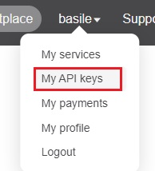

# Instructions:

This project can only run with a certain api + it's key.

We have to create a new (personal) key first before we can continue on this exercise!

## Create account on Openweathermap

Go to [this web page](https://openweathermap.org/).

1. Create an account or login.
2. Open your api keys:


3. If there is no key there yet, generate a new one.

## Create new files in your own project!

1. Create a `config.js` file with this code and paste your key in this file:
   * ```js
      const Data = {
        key : "45s64fdgs_Your_Key_dgfdfgq5gsg"
      }
      export default Data;
      ```
   This file is used to store keys and other types of sensible date you don't want to share publicly
2. Create a `.gitignore` file in which we will mention all the files we **don't** want to push to Github:
   * ```
      config.js // To hide any confidential keys
      .idea // Depending on your IDE
      .vscode // Depending on your IDE
      .DS_Store // OS specific files (this one if for Mac)
      ```
## Start

Go back to [Day 1](../Part1-Refactor) and continue the exercise!